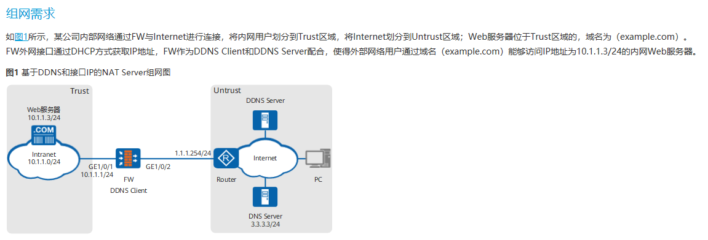
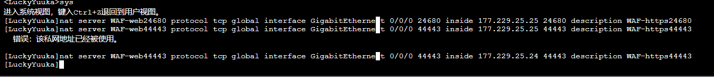
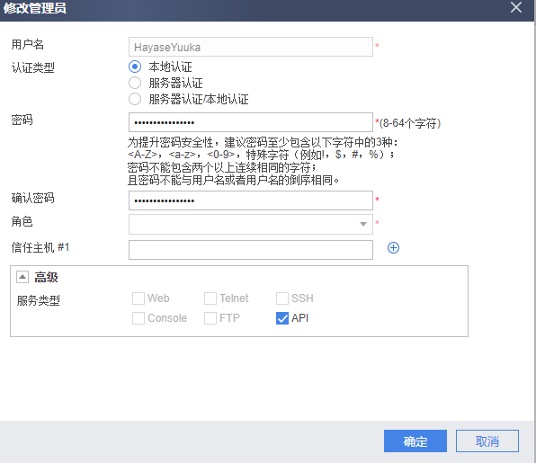
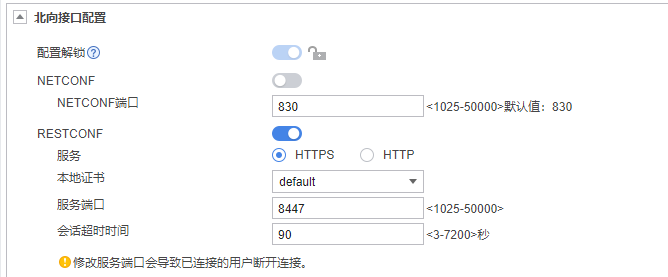

<p align="center"></p>
<h1 align="center">RESTCONF-YuukaChan</h1>
<h4 align="center">优香酱华为 USG 系列设备北向管理小工具 | HayaseYuuka Huawei USG Series Device RESTCONF Management Tool</h4><hr/>


## 适用场景

- 华为 USG 系列防火墙
- 版本号为 V500R005C20SPC500
- 支持并已经使能北向接口（RESTCONF）

USG 系列其它设备/版本号理论上不会区别太大，应该也能支持，如果不能支持稍微改动一下应该就能用

北向接口文档请参考对应设备的 `RESTCONF API 开发指南` ，在华为企业网站上可以下载

开发/测试使用设备及版本：USG6310S V500R005C20SPC500

## 使用场景

### 场景介绍

下面介绍本工具的使用场景

此小工具目前只能在限定的使用场景发挥作用，并不能支持所有的北向接口功能，只能在以下场景使用（所以是“小工具”，2333）

（使用场景类似 USG 产品文档 `CLI举例：公网用户通过DDNS和基于接口IP的NAT Server访问内部服务器` ，可供参考）

<details>   <summary>使用场景参考示意图(点击箭头展开/收合图片)</summary>   <p></p></details>

使用场景与上图略有不同，实际情况请参见以下表格

（概要：外网接口方式为 PPPOE 拨号动态获取 IP 地址，DDNS 服务使用阿里云 DDNS ，不在 FW 上配置 DDNS，出口有 ISP1 和 ISP2 两个，仅 ISP1 有公网）

| 项目                          | 数据                                                         | 说明                                                         |
| ----------------------------- | ------------------------------------------------------------ | ------------------------------------------------------------ |
| 接口号：GigabitEthernet 1/0/1 | IP地址：10.1.1.1/24<br/>安全区域：Trust                      | -                                                            |
| 接口号：GigabitEthernet 1/0/2 | IP地址：通过PPPOE方式获取<br/>安全区域：Untrust1             | ISP1 线路                                                    |
| 接口号：GigabitEthernet 1/0/3 | IP地址：通过PPPOE方式获取<br/>安全区域：Untrust2             | ISP2 线路                                                    |
| NAT Server                    | 名称：policy_web(+端口号)<br/>公网地址：借用GigabitEthernet 1/0/2 （ISP1）接口地址<br/>私网地址：10.1.1.3<br/>公网端口：80，443（等多个）<br/>私网端口：80，443（等多个） | -                                                            |
| DDNS                          | 内部服务器通过 AliDDNS 更新                                  | 应配置该服务器只能从 ISP1 接口上网，防止获取到 IPS2 的公网 IP |
| Web服务器                     | 地址：10.1.1.3/24                                            | -                                                            |
| 路由                          | ISP1 ISP2 策略路由智能选路                                   | 不在本工具讨论范围内，略                                     |

### 配置思路

（仅涉及本工具相关问题，剩下内容不再涉及，请参考产品文档解决）

- 配置接口IP地址和安全区域，完成网络基本参数配置（略）
- 配置安全策略，允许外部网络用户访问内部服务器（略）
- **配置基于接口的 NAT Server <- 本工具要解决的问题**
- 开启域名解析，配置DNS Server（略）
- 配置DDNS策略，并将其应用在GigabitEthernet 1/0/2接口上，使得外部用户通过域名（example.com）能够访问内网服务器（略）
- 在FW上配置缺省路由，使内网服务器对外提供的服务流量可以正常转发至ISP的路由器（略）

### 本工具要解决的问题

在配置基于接口的 NAT Server 时，使用以下命令：

```shell
1 [FW] nat server policy_web80 protocol tcp global interface GigabitEthernet 1/0/2 80 inside 10.1.1.3 80
2 [FW] nat server policy_web443 protocol tcp global interface GigabitEthernet 1/0/2 443 inside 10.1.1.3 443
 …… # 映射其它同 IP 服务器上的更多端口命令
```

第二行及之后的命令会报错“该私网地址已经被使用”，如下图所示：



联系华为客服确认：配置基于接口的 NAT Server 时，同一内网 IP 只能映射一个端口，如果有开放多个端口的需求，建议使用 NAT Static （和 WEB 页面一致的配置方法，需要指定公网 IP ）

**但是本场景下公网的 IP 地址不能确定，这会导致公网 IP 地址变动后外网用户无法访问在内网的服务器**

本工具通过调用设备的北向接口，通过 RESTCONF 北向接口获取指定接口当前 IP 地址，并将其填写到 NAT Server 的公网地址上，实现 NAT Static 中公网地址的动态更新，最终实现和基于接口的 NAT Server 一致的效果

## 使用前的准备

### 配置思路

- 创建一个有 api 权限的账户
- 使能 api 功能，协议为 tlsv1.2 的 https（必须） ；并使用高强度加密组件（推荐）
- 开放安全策略（local 区域相关）

### WEB 参考

系统 -> 设置 -> 管理员 -> 管理员 ->新建管理员

<details>   <summary>WEB-新建 API 用户示例(点击箭头展开/收合图片)</summary>   <p></p></details>

系统 -> 设置 -> 管理员 -> 设置 -> 北向接口配置

<details>   <summary>WEB-使能 API 示例(点击箭头展开/收合图片)</summary>   <p></p></details>

### CLI 参考

```shell
api
 api https enable
 security version tlsv1.2

manager-user HayaseYuuka 
  password cipher (括号这里是加密的密码)
  service-type api 
  level 15 
  authentication-scheme admin_local 
```

## 使用说明

### 文件说明

- YuukaChan.py <- 优香酱，小工具运行文件，开发环境为 Python 3.9.8
- requirements.txt <- 依赖包 `pip install -r requirements.txt`
- YuukaChanTemplate.xls <- 设定模板文件，最好不要修改，程序运行不依赖该文件
- YuukaChan.xls <- 设定文件，相关参数填写在这里，程序运行依赖该文件

### 使用说明及提示

1. 完成 “[使用前的准备](##使用前的准备)” 一节的配置，开放北向接口
2. 在服务器上安装 Python3 ，pip 安装依赖库
3. 填写 `YuukaChan.xls` 文件，填写时注意文件内的说明
4. 运行（调试/生产环境）: `python .\YuukaChan.py runDebug |python .\YuukaChan.py runProd`

- 调用本工具会对设备上的当前设定信息做保存(save)操作！
- 使用高强度的 API 账户密码保护北向接口
- 调试：`python .\YuukaChan.py runDebug` 是调试模式，另外还可以临时注释掉代码的 `try`(L61) 和 `except`(L490) 部分，更方便看报错信息
- 小工具目前实现了北向接口的 `创建NAT Server映射（PUT）方法` 和 `查看接口` 功能，主要还是以实现自己的需求为主，想调其它接口可以参照源码自行实现，也欢迎提交 PR ，新增更多功能

## 附录

- 为什么叫 RESTCONF-YuukaChan ？

因为设备就叫 Yuuka  优秀的优香酱能够帮 Sensei 完成工作，让 Sensei 从繁重的事务中解脱，然后狠狠滴找诺亚玩（doge)

<p align="center"></p><p align="center"></p><p align="center"></p>

- 求 Star⭐~
- 优香酱可爱捏

<p align="center"></p>
